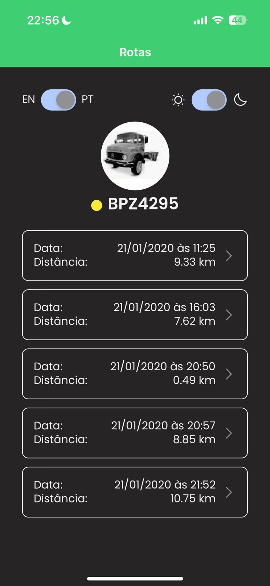

# Softruck - Frontend 3D Car

## Descrição

Aplicação frontend desenvolvida como parte do processo seletivo da Softruck. O projeto consiste em uma tela que exibe um carro animado se deslocando sobre um mapa, com base em dados reais de GPS.

## 📱 Preview do Projeto

### Funcionalidades Principais

-   🗺️ **Mapa Interativo**: Visualização de trajetos GPS em tempo real
-   🚗 **Animação Realista**: Sprite do carro rotaciona baseado na direção
-   ⚡ **Velocidade Dinâmica**: Movimento baseado nos dados reais de velocidade
-   🌍 **Multi-idioma**: Suporte completo PT/EN
-   🌙 **Temas**: Modo claro/escuro com sincronização do sistema

## 📸 Screenshots

Abaixo estão algumas capturas de tela do aplicativo em funcionamento:

|               Tela Inicial               |          Mapa com Carro Animado           |
| :--------------------------------------: | :---------------------------------------: |
|  |  |

## Tecnologias Utilizadas

### Framework Principal

-   **React Native com Expo**: Escolhido para desenvolvimento multiplataforma (iOS/Android) com facilidade de configuração e deploy. O Expo oferece APIs nativas otimizadas e um ambiente de desenvolvimento ágil.
-   **TypeScript**: Para tipagem estática, melhor IntelliSense, detecção de erros em tempo de desenvolvimento e maior robustez do código.

### Navegação e Roteamento

-   **Expo Router**: Sistema de roteamento baseado em arquivos, similar ao Next.js, que simplifica a navegação e oferece uma estrutura mais organizada para rotas.

### Estado Global

-   **Zustand**: Gerenciamento de estado leve e performático, escolhido pela simplicidade de implementação e menor boilerplate comparado ao Redux.

### Mapas e Localização

-   **React Native Maps**: Para renderização de mapas nativos com performance otimizada. Utiliza MapKit no iOS e Google Maps no Android.

### Internacionalização

-   **i18n-js** + **expo-localization**: Para suporte multilíngue completo, detectando automaticamente o idioma do dispositivo e oferecendo fallback para idiomas não suportados.

### Estilização

-   **StyleSheet (React Native)**: Optei por utilizar o StyleSheet nativo do React Native ao invés de SCSS, pois se trata de um projeto desenvolvido especificamente para mobile. O StyleSheet oferece:
    -   Performance otimizada para dispositivos móveis
    -   Tipagem nativa com TypeScript
    -   Integração perfeita com as APIs do React Native
    -   Sistema de unidades responsivo (utilizando função `resizePixel` personalizada)
    -   Menos dependências e configurações desnecessárias

### Arquitetura

-   **MVVM Pattern**: Separação clara entre View (componentes), ViewModel (lógica de apresentação) e Model (dados), facilitando manutenção e testes.

## Estrutura do Projeto

```
app/
├── @types/           # Tipagens TypeScript
├── components/       # Componentes reutilizáveis
├── constants/        # Dados estáticos e configurações
├── i18n/            # Arquivos de internacionalização
├── utils/           # Funções utilitárias
├── view_models/     # Lógica de negócio (MVVM)
├── views/           # Telas da aplicação
└── stores/          # Estados globais (Zustand)
```

## Funcionalidades Implementadas

### Principais

-   ✅ Mapa interativo com trajetos GPS
-   ✅ Animação de sprite do carro baseada na direção
-   ✅ Visualização de múltiplos pontos de trajeto

### Bônus

-   ✅ Velocidade do veículo influencia na animação
-   ✅ Seleção de diferentes trajetos pelo usuário
-   ✅ Interface multilíngue (PT/EN)
-   ✅ **Tema claro/escuro** com switch dinâmico
-   ✅ **Seletor de idioma** integrado

### Experiência do Usuário

-   🌙 **Modo Escuro/Claro**: Switch para alternar entre temas, com detecção automática do tema do sistema
-   🌍 **Multilíngue**: Seletor de idioma (Português/Inglês) com persistência da preferência
-   💾 **Persistência**: Preferências de tema e idioma são salvas localmente

## Como Executar

### Pré-requisitos

-   Node.js 18+
-   Expo CLI (`npm install -g @expo/cli`)
-   Dispositivo físico com Expo Go ou emulador configurado

### Instalação e Execução

```bash
# Clone o repositório
git clone git@github.com:marcusvbrabello/softruck.git | https://github.com/marcusvbrabello/softruck.git

# Instalar dependências
npm install

# Iniciar o servidor de desenvolvimento
npm start

# Escanear QR Code com Expo Go ou:
npm run android  # Para Android
npm run ios      # Para iOS
```

## Técnicas Destacadas

### Animação de Sprite

Implementação de sprite sheet para rotação do carro baseada na direção GPS, utilizando transformações CSS otimizadas.

### Responsividade

Sistema de redimensionamento automático através da função `resizePixel`, garantindo consistência visual em diferentes tamanhos de tela.

### Performance

-   Gerenciamento de estado otimizado com Zustand
-   Animações performáticas com transformações CSS nativas
-   Cálculos geográficos precisos usando fórmula de Haversine
-   Utilização de componentes nativos do React Native Maps

## Recursos Avançados

### Sistema de Temas

-   Detecção automática do tema do sistema (`useColorScheme`)
-   Persistência com AsyncStorage
-   Tema aplicado em todos os componentes, incluindo MapView
-   Transições suaves entre temas

### Internacionalização Avançada

-   Detecção automática do idioma do dispositivo
-   Fallback para idioma padrão
-   Textos dinâmicos em todos os componentes
-   Formatação de datas e números localizada

## Arquitetura Técnica

### Fluxo de Dados (MVVM)

```
View (React Components)
    ↕️
ViewModel (Custom Hooks)
    ↕️
Model (Zustand Stores + Constants)
```

### Gerenciamento de Estado

-   **Global**: Zustand para tracks e configurações
-   **Local**: useState para estados de componentes
-   **Persistente**: AsyncStorage para preferências

### Performance

-   Cálculos geográficos otimizados (Haversine)
-   Animações baseadas em transformações nativas
-   Throttling automático para animações fluidas

### Velocidade Baseada em Dados Reais

A animação do veículo utiliza os dados de velocidade (`speed`) registrados no GPS para calcular o tempo real entre pontos, proporcionando uma simulação fiel do trajeto original.

```typescript
const calculateSpeedBasedDelay = (current: any, next: any): number => {
	const speedKmh = current.speed || 30;
	const distance = calculateDistance(current, next);
	const timeInSeconds = distance / (speedKmh / 3.6);
	return Math.max(100, Math.min(2000, (timeInSeconds * 1000) / 100));
};
```
